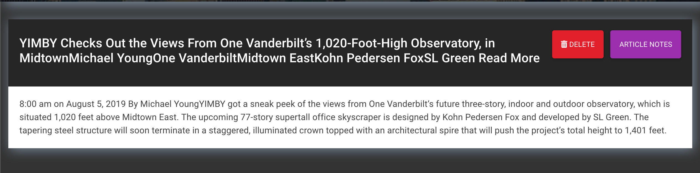

# webScraper

## Home Page | Landing Page

From this page, one has the "NavBar" options to Scrape new articles, view your saved articles, or refresh the home page.

This page displays the users saved articles, and allows the user to delete any saved articles from the database.

##Accessing the web Scraper

Heroku App Link: (https://webscrapperapp.herokuapp.com/)

GitHub Repo Link: (https://github.com/ejbronze/webScraper)
