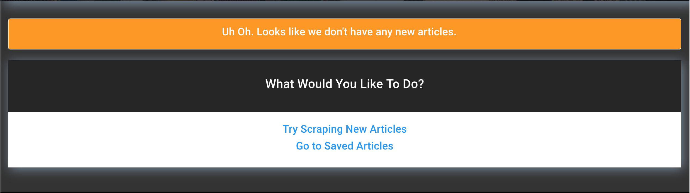

# webScraper

## Home Page | Landing Page

- From this page, one has the "NavBar" options to Scrape new articles, view your saved articles, or refresh the home page.

## Saved Articles Page

- This page displays the users saved articles, and allows the user to delete any saved articles from the database.
- In the event that the user has no saved articles, this is what they'll see
  

## Technologies | Skills used for this project:

- Heroku Deployment
- CLI
- HTML, CSS, JavaScript
- MongoDB
- gitHub

##Accessing the web Scraper WebApp

Heroku App Link: (https://webscrapperapp.herokuapp.com/)

GitHub Repo Link: (https://github.com/ejbronze/webScraper)
